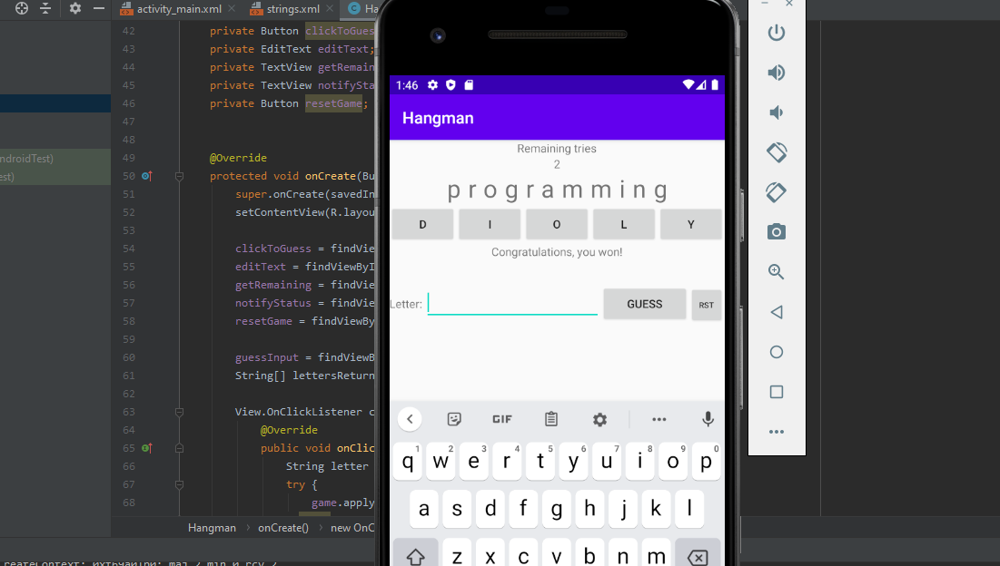

# hangmaninjava
Built with Java  
This program allows you to play hangman with your friends and family or by yourself in most cases!  
To run it:  
javac Hangman.java  
java Hangman [word-to-guess]

Made also Android version that serves the same purpose  
The user is prompted the length of the guess word and it prompts  
the remaining tries, each time you guess a letter it updates it on the screen  
and each time you get a letter wrong, the remaining tries decreases.  

Format: 
